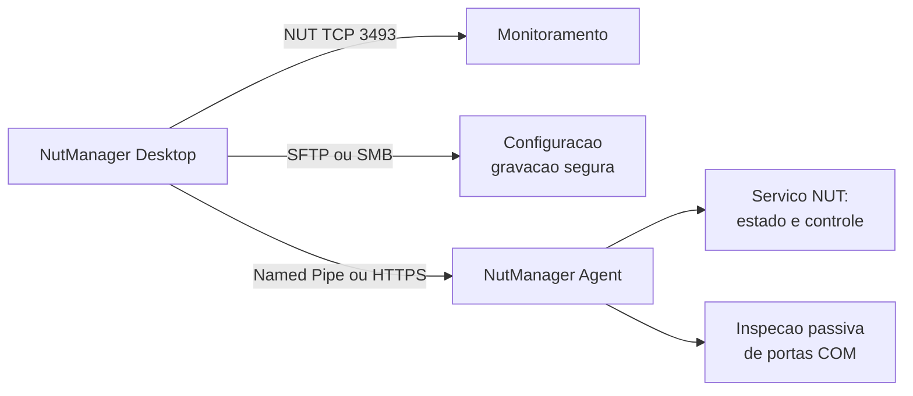

# NutManager — Manual do operador

> **Publicado no Notion.** Este arquivo é a fonte das 15 páginas criadas sob o hub
> *NutManager — T39 Installer, Packaging & Documentation*
> (`3c657ac0-7709-810b-b8d8-ec798f82a942`). Cada seção abaixo corresponde a uma página.
>
> O plano da T39 que já existia no hub foi preservado integralmente — as páginas do manual entraram
> como filhas dele, sem alterar seu conteúdo. Ao editar este arquivo, republique a página
> correspondente para que as duas não divirjam.
>
> **Sem capturas de tela.** Nenhum instalador foi executado numa máquina real, e uma captura inventada
> seria pior que a ausência dela. Os pontos onde uma imagem agregaria valor estão marcados com
> `[CAPTURA PENDENTE]`.

Documentos de arquitetura, segurança e build ficam no repositório e são a fonte da verdade técnica.
Este manual é operacional: ensina a instalar, configurar e diagnosticar.

---

## 1. Visão geral

O NutManager é um cliente e console de administração para o
[Network UPS Tools (NUT)](https://networkupstools.org/) em Windows. Ele não substitui o NUT: monitora,
configura e diagnostica a instalação que você já tem.

São **dois produtos separados**:

**NutManager Desktop** — o aplicativo que você abre. Monitora nobreaks, edita a configuração do NUT por
formulários gráficos e administra o serviço Windows.

**NutManager Agent** — um serviço Windows instalado *no servidor gerenciado*. Só é necessário quando
você administra um servidor remoto. Ele controla o serviço do NUT e inspeciona hardware serial de forma
passiva.

Instale um, o outro, ou os dois.

### Como o Desktop alcança um servidor



Três caminhos independentes, cada um com sua própria autenticação. Nenhum substitui outro, e **não há
fallback automático** entre eles: se o caminho escolhido falha, o NutManager diz qual falhou em vez de
tentar outro por baixo dos panos.

O que o Agent **não** faz: ele nunca lê nem escreve arquivos de configuração do NUT. Isso viaja apenas
por SFTP ou SMB.

### Fronteiras de confiança

| Fronteira | Quem autoriza |
| --- | --- |
| Monitoramento NUT TCP | o próprio `upsd`, por `upsd.users` |
| Configuração por SFTP | credencial SSH, com host key fixada por impressão SHA-256 |
| Configuração por SMB | identidade Windows atual ou conta explícita |
| Agent | pertencer ao grupo `NutManager Operators` |

---

## 2. Instalando o NutManager Desktop

### Requisitos

Windows 10 ou 11 x64, ou Windows Server 2019 em diante. Privilégio de administrador para instalar.
**Nenhum runtime .NET é necessário** — o aplicativo carrega o próprio.

### Baixando e conferindo

Baixe `NutManager-Setup-x.y.z.exe` e o `SHA256SUMS.txt`. Confira antes de executar:

```powershell
Get-FileHash .\NutManager-Setup-1.0.1.exe -Algorithm SHA256
```

Compare com a linha correspondente no `SHA256SUMS.txt`. Se divergir, **não execute**.

> Os instaladores **não são assinados** — não há certificado de code signing disponível. O SmartScreen
> vai avisar na primeira execução. Confira o SHA-256; ele é a verificação que você tem.

### Instalando

Execute o `.exe` e aceite a elevação. `[CAPTURA PENDENTE: assistente de instalação]`

Instala em `C:\Program Files\NutManager` e cria um atalho no Menu Iniciar. Não cria serviço, não abre
porta, não altera firewall.

### Primeira execução

Abra pelo Menu Iniciar. `[CAPTURA PENDENTE: primeira execução]`

Na primeira vez não há servidor configurado — siga a seção 5.

### Atualizando

Baixe a versão nova e execute. Ela detecta a anterior, remove e instala a nova. Suas configurações,
perfis e credenciais **não são tocados**.

Não instale uma versão mais antiga por cima de uma mais nova: o instalador recusa em vez de aplicar pela
metade.

### Reparando

Painel de Controle → Programas → NutManager → Reparar. Restaura arquivos do produto e o atalho. Não
toca nos seus dados.

### Desinstalando

Painel de Controle → Programas → NutManager → Desinstalar.

Remove os arquivos do programa, o atalho e o registro. **Preserva** `settings.json`,
`managed-servers.json` e as credenciais no Gerenciador de Credenciais do Windows — por construção, não
por opção: esses dados nunca fizeram parte do pacote, então a desinstalação não tem como alcançá-los.

Para removê-los, faça isso pelo aplicativo antes de desinstalar.

---

## 3. Instalando o NutManager Agent

### Quando você precisa dele

Só para administrar um servidor **remoto**. Você precisa dele se quer, a partir de outra máquina:

- ver o estado do serviço Windows do NUT;
- iniciar, parar ou reiniciar esse serviço;
- listar as portas COM do servidor.

Não precisa dele para monitorar por NUT TCP, nem para editar configuração por SFTP/SMB.

O Agent é instalado **no servidor**, não na sua estação.

### Requisitos

Windows Server 2019 em diante, ou Windows 10/11 x64. Administrador local.

**O Agent requer o Microsoft .NET Runtime 10 x64 e o Microsoft ASP.NET Core Runtime 10 x64.**
Diferente do Desktop, que carrega o próprio runtime, o Agent e o Agent Config usam os runtimes
compartilhados da máquina. Não é necessário Hosting Bundle nem IIS.

Isso é deliberado. O Agent é um serviço que fica no ar por meses num servidor; um runtime privado
dentro da pasta dele significaria que esse servidor só recebe correção de segurança do .NET quando sai
uma versão do NutManager. Usando o runtime da máquina, a atualização volta para onde o administrador
já cuida dela.

**Você não precisa instalar o runtime à mão.** O instalador verifica se existe:

| Situação | O que acontece |
| --- | --- |
| Os dois runtimes compatíveis já presentes | Mostra **Instalado** para ambos. Nada é baixado. Funciona sem internet. |
| Um runtime ausente | Mostra **Necessário** para ele, com a opção de instalar já marcada. |
| Runtime ausente e você desmarca sua opção | **Instalar Agent fica desabilitado**, com a explicação na tela. |

Qualquer versão de manutenção do 10.x serve. Um servidor já com 10.0.7 não baixa nada.

Quando o runtime precisa ser instalado, ele vem do endereço oficial da Microsoft, e o instalador
confere o hash antes de executar. Se o download falhar, a instalação falha dizendo que foi o download
— e não deixa um Agent quebrado para trás.

**Instalação sem internet:** funciona normalmente se o runtime já estiver na máquina. Se não estiver, é
preciso acesso à internet para baixar o pacote da Microsoft, ou instalá-lo manualmente antes.

**Desinstalar o Agent não remove o runtime.** Ele é um componente compartilhado do Windows, e outros
programas do servidor podem depender dele.

### Passo 1 — instale

Execute `NutManager-Agent-Setup-x.y.z.exe` como administrador.
`[CAPTURA PENDENTE: assistente do Agent]`

O instalador:

- instala em `C:\Program Files\NutManager Agent`;
- registra o serviço `NutManagerAgent` como **LocalSystem**, inicialização **Automática**;
- registra a origem `NutManager Agent` no Log de Eventos;
- cria `C:\ProgramData\NutManager\Agent`;
- instala **NutManager Agent Config** e seu atalho no menu Iniciar;
- deixa o serviço parado para a configuração administrativa inicial.

O que ele **não** faz: não instala o NUT, não altera arquivo nenhum do NUT, não inicia nem para o
serviço do NUT, não abre porta, não cria certificado, não mexe no firewall.

Antes de tudo isso o instalador mostra os **Termos de Uso do NutManager**, que precisam ser aceitos.
O texto vem dentro do instalador e é legível sem internet. Os Termos são separados da licença: o
código-fonte continua sob **GNU GPL v2.0**, e os Termos não restringem os direitos dela.

A página final mostra apenas o que o instalador conseguiu comprovar. O estado real do grupo,
transportes e recursos HTTPS aparece no Agent Config; o instalador não consulta SAM/AD e não inventa
um resultado verde ou vermelho para `NutManager Operators`.

### Passo 2 — configure no NutManager Agent Config

Abra **NutManager Agent Config** pelo menu Iniciar. O aplicativo pede elevação porque administra
somente recursos locais pertencentes ao Agent.

1. Em **NutManager Operators**, clique em **Criar grupo** se ele não existir e depois use
   **Adicionar usuário** para incluir as contas autorizadas. Em estação ou member server o grupo é
   local. Em controlador de domínio não há SAM local: a criação alcança o diretório e exige uma
   confirmação separada.
2. Escolha `SMB (Named Pipe)`, `HTTPS` ou ambos. Pelo menos um transporte precisa permanecer ativo; o
   último não pode ser desmarcado até o outro ser habilitado.
3. Se usar HTTPS, informe host/FQDN e porta e selecione um certificado válido de `LocalMachine\My`.
4. Clique em **Aplicar**. Salvar não inicia um Agent parado. Se ele já estiver rodando, o aplicativo
   oferece um reinício explícito e nunca reinicia silenciosamente.
5. Confira **Diagnóstico** e clique em **Iniciar Agent** quando grupo, transportes e NUT estiverem
   corretos.

**Sem o grupo o serviço não inicia.** Isso é deliberado: a ACL do Named Pipe é construída a partir do
SID de `NutManager Operators`, e o Agent nunca cai para Administradores. O utilitário resolve e adiciona
membros por SID; não executa `net`, PowerShell, `cmd`, `sc.exe` ou `netsh`.

### Instalação desassistida

```powershell
NutManager-Agent-Setup-1.0.1.exe /quiet
```

Instala por padrão cada runtime Microsoft necessário que estiver faltando. Para recusar
deliberadamente um ou ambos:

```powershell
NutManager-Agent-Setup-1.0.1.exe /quiet InstallDotNetRuntime=0 InstallAspNetRuntime=0
```

`InstallDotNetRuntime` controla o Microsoft .NET Runtime 10 x64 e `InstallAspNetRuntime` controla o
Microsoft ASP.NET Core Runtime 10 x64. Se um runtime estiver ausente e sua opção estiver em `0`, a
instalação **falha antes de registrar o serviço**. Isso é intencional: um `NutManagerAgent` registrado
que não inicia é pior que uma recusa, porque a recusa aparece e o serviço quebrado não.

### Passo 3 — verifique

```powershell
Get-Service NutManagerAgent | Format-List Name, Status, StartType
```

Espere `Running` e `Automatic`. Para confirmar a conta do serviço:

```powershell
Get-CimInstance Win32_Service -Filter "Name='NutManagerAgent'" | Select-Object Name, StartName, PathName
```

Espere `LocalSystem` em `StartName`.

Confirme que o NUT continua como estava:

```powershell
Get-Service | Where-Object { $_.Name -like "*nut*" -or $_.DisplayName -like "*UPS*" } | Format-Table Name, Status, StartType
```

### Passo 4 — conecte pelo Desktop

Named Pipe é o padrão e não exige configuração de rede. No perfil do servidor, deixe o transporte do
Agent em Named Pipe e use Testar conexão.

### Atualizando

Execute o instalador novo. Ele pode parar o `NutManagerAgent` para trocar os próprios binários, mas
não o inicia nem reinicia. Revise o diagnóstico no Agent Config e inicie-o explicitamente.

**O serviço do NUT não é reiniciado.** O nome dele não aparece em lugar nenhum do pacote.

O `agent.json` é preservado.

### Reparando e desinstalando

Reparar restaura binários, o registro do serviço e a origem do Log de Eventos. Preserva o `agent.json`.

Desinstalar para e remove **apenas** o `NutManagerAgent`, seus arquivos e a origem do Log de Eventos.
Preserva: `agent.json`, certificados, bindings SSL, reservas de URL, regras de firewall, o grupo
`NutManager Operators`, credenciais e tudo do NUT.

---

## 4. Configurando HTTPS no Agent

**Opcional.** O Named Pipe atende a maioria dos casos e não abre porta. Use HTTPS quando o pipe não
serve — tipicamente um cliente fora do domínio do servidor, que não consegue estabelecer sessão SMB.

Nada disso ocorre durante o MSI. Abra **NutManager Agent Config**, habilite HTTPS, informe o host/FQDN
e a porta e selecione um certificado já existente em `LocalMachine\My`.

O certificado precisa ter chave privada, estar dentro da validade, permitir autenticação de servidor
e cobrir o host no SAN. O aplicativo mostra subject, emissor, validade e thumbprint e explica por que
uma seleção não pode ser usada. Ele não cria, importa, exporta nem apaga certificados.

Ao aplicar, o utilitário configura o binding SSL e a reserva de URL pelo HTTP Server API e a regra de
entrada pelas APIs do Windows Firewall. Cada recurso recebe uma identidade do NutManager. Recurso de
outro proprietário ou de propriedade incerta nunca é sobrescrito nem apagado.

O `agent.json` resultante, em `C:\ProgramData\NutManager\Agent`, contém somente seleção de transporte,
prefixo e thumbprint, por exemplo:

```json
{
  "namedPipeEnabled": true,
  "httpsEnabled": true,
  "httpsPrefix": "https://servidor.exemplo.local:5199/",
  "certificateThumbprint": "<THUMBPRINT>"
}
```

O arquivo é gravado por safe-write com validação, temporário no mesmo volume, flush, ACL de SYSTEM e
Administradores, releitura e substituição atômica. Se a configuração dos recursos falhar, o arquivo
não é confirmado.

Para desativar HTTPS, mantenha Named Pipe ativo se necessário e desmarque HTTPS. A confirmação permite
remover seletivamente apenas regra, binding e reserva comprovadamente pertencentes ao NutManager, ou
somente desativar o transporte. O certificado nunca é removido.

### Autenticação

O listener exige **Negotiate** e recusa anônimo. Pertencer a `NutManager Operators` continua
obrigatório. Não há token, nem Basic, nem senha no protocolo.

No perfil do Desktop, escolha:

- **Identidade Windows atual** — a conta que roda o NutManager. Nada é armazenado.
- **Conta alternativa** — outra conta. A senha vai para o Gerenciador de Credenciais do Windows sob o
  alvo do próprio Agent, **separada** das credenciais SMB e SSH. Uma autoriza ler arquivos; a outra
  autoriza controlar um serviço; um segredo guardado não deve conceder as duas.

### Erros comuns

| Sintoma | Causa provável |
| --- | --- |
| Falha ao conectar, nada no log | binding SSL ausente ou porta divergente |
| `Access denied` | conta fora de `NutManager Operators` |
| Erro de certificado no cliente | FQDN fora do SAN, ou CA não confiável no cliente |
| Funciona local, falha remoto | regra de firewall ausente |
| HTTPS desabilitado | `httpsEnabled` continua `false` no `agent.json` |

---

## 5. Adicionando o primeiro servidor

Em **Configurações → Perfis de servidor gerenciado**, crie um perfil.

**Monitoramento** — host e porta do NUT (padrão 3493) e, opcionalmente, o nobreak preferido.

**Gerenciamento** — Local ou Remoto.

Perfil **Local** administra a instalação do NUT desta máquina.

Perfil **Remoto** precisa escolher o transporte de configuração:

- **SFTP** — host, porta, usuário e autenticação por senha ou chave privada. A host key exige confiança
  explícita por impressão SHA-256 na primeira conexão.
- **SMB** — caminho UNC do compartilhamento. Identidade Windows atual ou conta explícita.

**Acesso** — `ReadOnly` inspeciona; `Manage` grava, e só depois de uma verificação explícita de
capacidade de gravação segura no diretório escolhido.

**Arquivos gerenciados** — quais dos cinco arquivos do NUT este perfil administra.

**Agent** — transporte (Named Pipe ou HTTPS), endpoint e autenticação, conforme a seção 4.

Use **Testar conexão**. `[CAPTURA PENDENTE: perfil e teste de conexão]`

> Trocar o perfil ativo pede reinício do aplicativo. Isso é proposital: sessões de transporte e
> credenciais são estabelecidas na inicialização, e trocá-las a quente deixaria estados parciais.

---

## 6. Configurando o NUT

Cinco arquivos, cada um com formulário gráfico próprio: `nut.conf`, `ups.conf`, `upsd.conf`,
`upsd.users` e `upsmon.conf`.

Você não edita texto. O caminho é:

```text
Formulario grafico
  -> rascunho semantico
  -> validacao por schema
  -> documento que preserva a sintaxe original
  -> revisao
  -> previa gerada
  -> gravacao segura
  -> Local / SFTP / SMB
```

O que isso garante: comentários, ordem, aspas, espaçamento, diretivas desconhecidas e seções não
gerenciadas são preservados. O NutManager não reescreve seu arquivo — ele altera o que você pediu e
devolve o resto intacto.

Toda gravação passa por: prévia somente leitura com segredos ocultos → backup → escrita em arquivo
temporário → validação → substituição segura → verificação → rollback em caso de falha.

`[CAPTURA PENDENTE: revisão e prévia antes de aplicar]`

> **Aplicar nunca reinicia o NUT.** A configuração é gravada; ativá-la é decisão sua, num passo
> separado.

---

## 7. Dispositivos e drivers

Em **Administração → Dispositivos e drivers**.

**Dispositivos configurados** vem do `ups.conf`: nome do nobreak, driver, porta e protocolo.

**Portas COM detectadas** vem do hardware. Localmente, do Windows desta máquina; num perfil remoto, do
Agent. A tela sempre diz qual origem está mostrando.

Cada porta traz nome amigável, fabricante, VID/PID e o controlador quando os identificadores permitem
concluir com segurança. Um chipset só é nomeado quando o identificador prova; nada é adivinhado.

Estado de cada porta:

| Estado | Significado |
| --- | --- |
| Verde | Presente, e o Windows reportou código de falha zero |
| Âmbar | Presente, com falha ou estado diferente de OK |
| Cinza | Presente, e nada mais se sabe. **Não é erro** |
| Vermelho | Nomeada, mas o sistema não a expõe no momento |

Cinza é comum e não indica problema: significa que a porta existe e o Windows não tem metadados sobre
ela.

A porta configurada no `ups.conf` é comparada com o que foi detectado — "Configurada · detectada no
servidor" confirma que o que está escrito corresponde ao hardware.

**A inspeção remota é passiva.** Nenhuma porta é aberta, nenhum byte transmitido, nenhum driver
executado. Um driver do NUT conversando com o nobreak não é interrompido.

Por isso os **diagnósticos ativos** (`upsdrvctl`, ajuda do driver, listagem de variáveis, coleta de
dados) permanecem **apenas locais**: eles abrem o dispositivo, e abrir o dispositivo enquanto o NUT o
usa quebraria o monitoramento.

`[CAPTURA PENDENTE: dispositivos e drivers]`

---

## 8. Serviço Windows

Em **Administração → Serviço do Windows**: estado, identidade e id do processo do serviço do NUT.

Perfil local administra diretamente. Perfil remoto administra pelo Agent.

Iniciar, Parar e Reiniciar exigem confirmação explícita **a cada execução**. Toda operação de controle
é registrada no Log de Eventos do servidor, na origem `NutManager Agent`.

> Parar o serviço do NUT interrompe o monitoramento e o desligamento automático em queda de energia.
> Não faça isso só para testar.

---

## 9. Credenciais e segurança

Quatro domínios separados. **Nenhum deles empresta segredo para outro.**

**SSH/SFTP** — senha ou passphrase de chave. Só da sessão por padrão; pode ser gravada no Gerenciador de
Credenciais do Windows depois de uma conexão bem-sucedida. O perfil guarda só o caminho da chave.

**SMB** — senha da conta explícita, coletada pelo diálogo de credenciais do próprio Windows. Usando a
identidade Windows atual, não há segredo algum.

**Agent** — senha da conta alternativa do HTTPS, sob alvo próprio no Gerenciador de Credenciais.
Separada da credencial de configuração de propósito.

**Segredos do NUT** — senhas dentro de `upsd.users` e `upsmon.conf`, e o `CERTIDENT`. São
**somente-alteração**: um valor já existente nunca é lido de volta para a interface, revisão ou prévia.
O NutManager informa apenas se existe ou não.

### O que nunca vai para o JSON do perfil

Nenhuma senha, nenhuma passphrase, nenhum material de chave privada. O `managed-servers.json` guarda só
metadados: host, porta, usuário, modo de autenticação e caminho da chave.

---

## 10. Backup, rollback e recuperação

Toda gravação de configuração segue a mesma sequência:

1. **Prévia** — texto somente leitura, segredos ocultos;
2. **Backup** — cópia do arquivo atual;
3. **Escrita temporária** — grava num arquivo lateral;
4. **Validação** — confere o que foi escrito;
5. **Substituição segura** — troca atômica;
6. **Verificação** — relê e confirma;
7. **Rollback** — em qualquer falha, restaura o backup.

Se algo falhar no meio, o arquivo original continua íntegro. Se nem o rollback funcionar — disco cheio,
permissão revogada durante a operação — o NutManager informa exatamente qual passo falhou e onde está o
backup, para recuperação manual.

---

## 11. Diagnóstico de problemas

| Sintoma | O que verificar |
| --- | --- |
| **Agent indisponível** | serviço `NutManagerAgent` rodando no servidor |
| **Access denied no Agent** | conta pertence a `NutManager Operators`; relogar após incluir |
| **Named Pipe não conecta** | cliente consegue sessão SMB com o servidor; nome resolvendo |
| **HTTPS não conecta** | binding SSL, reserva de URL, firewall — seção 4 |
| **Erro de certificado** | FQDN no SAN; CA confiável no cliente; certificado não expirado |
| **Negotiate falha** | conta alternativa e senha corretas; conta não bloqueada |
| **Serviço do NUT parado** | é do NUT, não do NutManager; verifique o log do NUT |
| **NUT TCP indisponível** | `upsd` rodando; porta 3493 acessível; `upsd.users` permite a conta |
| **Nenhuma porta COM** | há porta serial na máquina; origem correta (local × Agent) |
| **Porta COM sem metadados** | normal — estado cinza; o Windows não expõe dados dela |
| **"ups.conf ainda não foi lido"** | sessão de configuração não estabelecida; conecte o perfil |
| **SFTP: host key mismatch** | a chave do servidor mudou. **Investigue antes de confiar** |
| **SMB: gravação indisponível** | verificação de gravação segura falhou no diretório escolhido |
| **Credencial ausente** | não foi gravada, ou foi removida do Gerenciador de Credenciais |
| **Perfil exige reinício** | comportamento esperado ao trocar o perfil ativo |

Onde olhar:

- **Log de Eventos do servidor**, origem `NutManager Agent` — toda operação de controle;
- **log do NUT**, para problemas do próprio NUT;
- **prévia e revisão** no NutManager, antes de aplicar qualquer configuração.

---

## 12. Atualização e desinstalação

| | Desktop | Agent |
| --- | --- | --- |
| Atualizar | executar o instalador novo | executar o instalador novo |
| Serviço parado | nenhum | apenas `NutManagerAgent` |
| Preservado | settings, perfis, credenciais | `agent.json`, certificados, grupo, firewall |
| Removido ao desinstalar | binários, atalho, registro | binários, serviço, origem de log |
| Downgrade | recusado | recusado |

Nem a atualização nem a desinstalação de qualquer um dos dois toca no NUT.

Não há atualização automática. Atualizar é baixar e executar.

---

## 13. Arquitetura para administradores

Ver a seção 1. Aprofundamento fica no repositório:

- [Architecture](../ARCHITECTURE.md)
- [Windows Agent](../WINDOWS-AGENT.md)
- [Installer architecture](../INSTALLER-ARCHITECTURE.md)

---

## 14. Matriz de compatibilidade

Ver [Packaging and release](../PACKAGING-AND-RELEASE.md).

> **Nada está marcado como validado.** Nenhum instalador foi executado numa máquina real até o momento
> em que este manual foi escrito. As linhas marcadas como *Expected* significam que nada indica falha e
> ninguém testou.

---

## 15. Notas de versão

**1.0.1** — primeira versão pública do NutManager.

Artefatos: `NutManager-Setup-1.0.1.exe`, `NutManager-Agent-Setup-1.0.1.exe`,
`NutManager-win-x64.zip`, `SHA256SUMS.txt`. Confira os checksums antes de instalar.

O Agent permanece **framework-dependent** e requer o .NET Runtime 10 e o ASP.NET Core Runtime 10 no
servidor. O instalador detecta cada um independentemente e pode instalar os pacotes oficiais da
Microsoft quando estiverem ausentes. O Agent Config vem no mesmo pacote e não adiciona outro runtime.

Compatibilidade: o protocolo do Agent não mudou. Um Desktop novo conversa com um Agent antigo e
vice-versa; capacidades ausentes são detectadas pelo handshake em vez de assumidas.

Limitações conhecidas: artefatos não assinados; sem atualização automática; nenhuma configuração
validada em máquina real.
